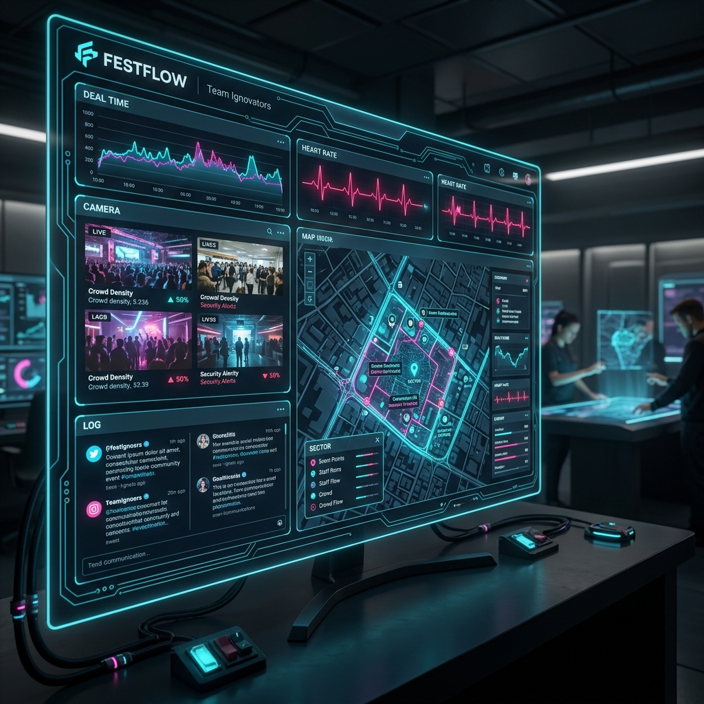

# 🚀 FESTFLOW | THE COMMAND CENTER

<div align="center">
  
  <br />
  
  
  
</div>

---

## 🌌 THE VISION
**FestFlow** is the ultimate event management nexus. Developed by **Team Ignovators**, it transforms complex hardware data into a stunning, actionable Command Center. Monitor every heartbeat, every movement, and every alert within a unified, high-octane digital environment.

> *"Where safety meets state-of-the-art technology."*

---

## ✨ ELITE FEATURES

### ⚡ Neural Interface (WebSerial)
Connect directly to your hardware nodes via the WebSerial API. Experience zero-latency data streaming from ESP32/Arduino-based wristbands.

### 📍 Geospatial Matrix
Real-time GPS and sector-based localization. Track your assets across HQ, Alpha, Beta, and Delta zones with integrated Leaflet.js mapping.

### 🚨 Panic Alert Protocol
An automated watchdog system that monitors vitals. Any anomaly (like a Heart Rate spike > 160 BPM) triggers a system-wide Panic Level Alert with neon-themed visual cues.

### 🎨 Cyber-Circuit Aesthetic
An immersive interface featuring:
- **Animated SVG Trace Paths**: Data pulses moving through virtual circuitry.
- **Glassmorphic Panels**: Sleek, transparent UI layers for maximum clarity.
- **Dynamic Status LEDs**: Instant visual feedback on system health.

---

## 🛠️ CORE ARCHITECTURE

| Layer | Technology |
| :--- | :--- |
| **Logic** | JavaScript (ES6+ / Async) |
| **Styling** | Vanilla CSS3 (Custom Design System) |
| **Hardware** | WebSerial API |
| **Mapping** | Leaflet.js |
| **Fonts** | Orbitron, Share Tech Mono, Rajdhani |

---

## 🚀 DEPLOYMENT

### 1. Initialize
Clone the core repository to your local machine:
```bash
git clone https://github.com/AniruddhaMJois/festflow.git
```

### 2. Launch Interface
Open `index.html` in a WebSerial-compatible browser (Google Chrome or Microsoft Edge).

### 3. Establish Link
- **Login**: Use the terminal-themed auth portal.
- **Link**: Click **LINK_HARDWARE** to select your COM port.
- **Monitor**: Watch as the system synchronizes with your hardware nodes.

---

## 👥 THE IGNOVATORS TEAM
**Pioneering the future of festival and event safety.**

*Lead Developers & Hardware Architects dedicated to excellence.*

---
<div align="center">
  <sub>Made with ❤️ by <b>Team Ignovators</b></sub>
</div>
